# Candela Restaurant 

<p align="center">
  <a href="https://github.com/ArkanLab/candela/actions/workflows/ci.yml"></a>
  <a href="https://github.com/ArkanLab/candela/actions/workflows/linters.yml"></a>
  
  
  
</p>

> 🕯️ تطبيق إدارة مطعم ومقهى إيطالي متكامل مبني على Frappe v16
> 🕯️ Complete Italian Café & Restaurant management app built on Frappe v16

**Candela** lights up your restaurant operations with an all-in-one management platform — from elegant digital menus and table reservations to a full-featured POS, live kitchen display, procurement workflows, production tracking, and a stunning customer-facing website. Built for Italian cafés and fine dining, yet flexible enough for any food service concept.

---

## 🌍 Domain Analysis

**Industry:** Food & Beverage / Restaurant Technology (RestaurantTech)
**Segment:** Full-service restaurant management — covering dine-in, takeaway, delivery, and catering
**Markets:** Middle East & North Africa (MENA), with multi-language support (English, Arabic, Italian)
**Business Model:** Open-source (MIT), self-hosted on Frappe/ERPNext infrastructure

### Why Candela Exists
Traditional restaurant POS systems handle transactions but miss the full picture. Candela bridges the gap between front-of-house elegance and back-of-house operations — recipe costing, ingredient-level stock tracking, procurement workflows, production logging, marketing campaigns, and corporate catering — all in one platform tied to ERPNext's accounting backbone.

---

## 👥 Key Personas

| Persona | Role | What They Do | Pain Points Solved |
|---------|------|-------------|-------------------|
| **Restaurant Owner** | Candela Manager | Oversees revenue, food cost %, staff performance, daily P&L | Scattered data across POS, spreadsheets, and WhatsApp |
| **Head Chef** | Candela Chef | Manages recipes, production, kitchen stations, ingredient stock | No visibility into food cost or waste tracking |
| **Cashier** | Candela Cashier | Runs POS shifts, handles payments, records daily expenses | Manual cash reconciliation with no audit trail |
| **Waiter / Host** | Candela Waiter | Manages reservations, seats guests, takes orders | Paper reservation books, no table status visibility |
| **Procurement Officer** | Candela Procurement | Creates purchase requests/orders, receives goods, manages suppliers | Disconnected ordering from actual kitchen consumption |
| **Marketing Manager** | Candela Marketing | Runs campaigns, manages reviews, tracks ROI, promo codes | No link between campaigns and actual sales data |

---

## 🏆 Competitive Landscape

| Competitor | Strengths | Candela's Advantage |
|-----------|----------|-------------------|
| **Toast POS** | Market leader, strong POS UX | Open-source, self-hosted, ERP-integrated |
| **Square for Restaurants** | Simple setup, ecosystem | Full procurement + production tracking |
| **Lightspeed Restaurant** | Multi-location support | Recipe-level food costing + CAPS permissions |
| **iFood / Foodics** | MENA market presence | Arabic-first with ERPNext accounting integration |
| **Odoo F&B** | ERP integration | Purpose-built restaurant UX (KDS, table map, reservations) |

**Our Edge:** Full vertical integration from customer-facing website → POS → kitchen display → procurement → production → accounting, all on Frappe v16 with Arabic/Italian/English trilingual support.

---

## 🔧 Installation

```bash
bench get-app --branch main https://github.com/moatazarkan6-lab/candela.git
bench --site <site> install-app candela
bench build --app candela
bench migrate
```

### Requirements
- Frappe v16+
- CAPS app (for capability-based access control)
- Python 3.10+, Node.js 18+, MariaDB 10.6+

---

## 📋 Modules (55 DocTypes)

| Module | DocTypes | Description | الوصف |
|--------|---------|------------|-------|
| Menu & Dining | 7 | Menu items, categories, ingredients, recipes, dietary tags | المنيو والمكونات والوصفات |
| Operations | 8 | Reservations, online orders, POS invoices, table management | الحجوزات والطلبات ونقاط البيع |
| Kitchen & Production | 5 | Kitchen stations, display system, production logs, waste tracking | المطبخ والإنتاج وتتبع الهدر |
| Procurement & Stock | 9 | Suppliers, POs, GRNs, warehouses, stock entries, reconciliation | المشتريات والموردين والمخزون |
| Marketing & CRM | 8 | Campaigns, influencers, reviews, personas, corporate accounts | الحملات والمؤثرين والمراجعات |
| Assets & Maintenance | 3 | Restaurant assets, maintenance scheduling, equipment tracking | الأصول والصيانة الوقائية |
| Guest Engagement | 6 | Reviews, newsletter, gallery, events, gift cards, promo codes | التقييمات والنشرة والمعرض |
| Staff & HR | 4 | Chef profiles, staff members, shifts, daily closing | الشيفات والموظفين والورديات |
| Governance | 3 | Price logging, stock deduction rules, audit trail | تسجيل الأسعار وخصم المخزون |
| Settings | 2 | Central configuration, VAT/tax settings | الإعدادات المركزية والضرائب |

---

## 👥 User Roles & CAPS Integration

| Role | Access Level | CAPS Bundle | الصلاحية |
|------|-------------|-------------|---------|
| Candela Manager | Full access — all modules, settings, reports | CD Admin Bundle | وصول كامل |
| Candela Chef | Kitchen, production, menu, stock alerts | CD Kitchen Bundle | المطبخ والإنتاج |
| Candela Cashier | POS, orders, daily closing, expenses | CD POS Bundle | نقطة البيع |
| Candela Waiter | Reservations, tables, orders, customer notes | CD Service Bundle | الحجوزات والطاولات |
| Candela Procurement | Suppliers, POs, GRNs, stock, warehouses | CD Procurement Bundle | المشتريات |
| Candela Marketing | Campaigns, reviews, website, newsletter | CD Marketing Bundle | التسويق |
| Candela Staff | Basic operations access | — | وصول أساسي |

**21 CAPS capabilities** across **6 bundles** with **6 field-level restrictions** (cost data masking for non-managers).

---

## 🖥️ Screens & Routes

### Public Website (Customer-Facing)
| Screen | Route | Description |
|--------|-------|------------|
| Homepage | `/dela` | Restaurant website with hero, menu highlights, events |
| Menu | `/dela/menu` | Full digital menu with categories & dietary filters |
| Reservation | `/dela/reservation` | Table booking form with time slots |
| Online Order | `/dela/order` | Delivery/pickup ordering with payment |
| Order Tracking | `/dela/order_tracking` | Real-time order status |
| Gallery | `/dela/gallery` | Photo gallery |
| Events | `/dela/events` | Upcoming restaurant events |
| About | `/dela/about` | Restaurant story |
| Contact | `/dela/contact` | Location & contact info |

### Admin Dashboard (Staff-Facing)
| Screen | Route | Description |
|--------|-------|------------|
| Dashboard | `/deladmin` | Management overview with KPIs |
| POS Terminal | `/deladmin/pos` | Full point of sale |
| Kitchen Display | `/deladmin/kitchen` | Live order queue by station |
| Table Map | `/deladmin/tables` | Visual table status |
| Reports | `/deladmin/reports` | Sales, food cost, reservations |
| Inventory | `/deladmin/inventory` | Stock levels & alerts |
| Procurement | `/deladmin/procurement` | Purchase management |
| Production | `/deladmin/production` | Kitchen production logs |
| Marketing | `/deladmin/marketing` | Campaigns & CRM |
| Staff | `/deladmin/staff` | Shifts & scheduling |
| Warehouses | `/deladmin/warehouses` | Storage locations |
| Assets | `/deladmin/assets` | Equipment tracking |
| Daily Closing | `/deladmin/closing` | End-of-day reconciliation |
| Shifts | `/deladmin/shifts` | POS shift management |
| Users | `/deladmin/users` | Visual CAPS user management |

### App Information
| Screen | Route | Description |
|--------|-------|------------|
| About Candela | `/candela-about` | 10-slide app showcase storyboard |
| Onboarding | `/candela-onboarding` | Interactive walkthrough |

---

## 🎨 Brand Identity

| Property | Value |
|----------|-------|
| **Primary Color** | `#F59E0B` (Amber) |
| **Dark Color** | `#1C1917` (Stone 900) |
| **Prefix** | CD |
| **Organization** | moatazarkan6-lab |
| **Logo** | Animated SVG candle flame (512×512) |
| **Sales Tone** | Creative & inspiring — *"Light up your restaurant operations"* |

---

## 🌐 Internationalization

- **English** — Full UI, website, onboarding
- **Arabic** — Complete translation (1242/1242 strings), RTL support
- **Italian** — Menu items, categories, restaurant identity fields

---

## 🔗 Integrations

| System | Purpose |
|--------|---------|
| **ERPNext** | Accounting, financial reporting |
| **CAPS** | Capability-based access control (21 capabilities) |
| **HRMS** | Staff/employee management |
| **frappe_visual** | App map, ERD, storyboard, floating windows |
| **Paymob** | Payment gateway (Egypt) |
| **Fawry** | Payment gateway (Egypt) |
| **WhatsApp** | Staff notifications, customer communication |
| **Google Analytics** | Website analytics |
| **Meta Pixel / TikTok** | Marketing attribution |

---

## 📄 License

MIT — Free for commercial and personal use.

## Contact

For support and inquiries:
- Phone: +201508268982
- WhatsApp: https://wa.me/201508268982

